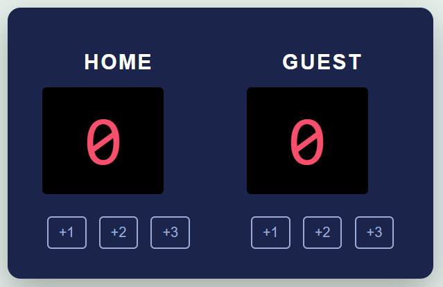

# 🏀 Basketball Scoreboard
A simple and interactive basketball scoreboard built using **HTML**, **CSS**, and **JavaScript**. This project allows users to track scores for HOME and GUEST teams by clicking buttons.

## 🚀 Features
- Add +1, +2, or +3 points for each team
- Real-time score updates
- Clean and modern UI
- Beginner-friendly project
- Responsive centered layout

## 🛠 Technologies Used
- HTML5
- CSS3
- JavaScript (Vanilla JS)

## 📸 Screenshot

  

