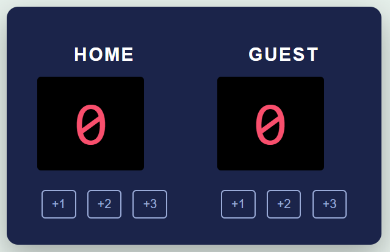

# 🏀 Basketball Scoreboard (Dockerized)
A simple and interactive basketball scoreboard built using **HTML**, **CSS**, and **JavaScript**.
This project is now containerized using **Docker** and served using **Nginx**.

## 🚀 Features
- Add +1, +2, or +3 points for each team
- Real-time score updates
- Clean and modern UI
- Beginner-friendly project
- Responsive centered layout

## 🛠Technologies Used
- HTML5
- CSS3
- JavaScript (Vanilla JS)
- Docker
- Nginx

## 🐳 How to Run with Docker

### 1. Build Docker Image
```bash
docker image build -t basketball-score:v1.0.0 .
```

### 2. Run Container
```bash
docker container run -d --basketballscore -p 8080:80 basketball-score:v1.0.0
```

### 3. Open in browser
http://localhost:8080


## 📸 Screenshot
<p align="center">
  
</p>


